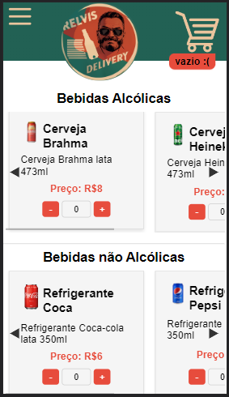

---

LINK PROJECT : 

  

Aplicação de um e-comerce simples aonde usuário faz o pedido e é direcionado para whats da empresa para finalizar o pedido, a ideia é ser simples e prático, ultilizei HTML, CSS, TypeScript e Next.js, foi um grande desáfio.

Ultilizei Context para gerenciamento global de estados,  primeira vez que uso context em uma aplicação next.js e tem sua particularidades ultilizar context em next.js compardo ao react.js.
https://legacy.reactjs.org/docs/context.html

Instruções
O desafio consiste em criar uma loja virtual simples.
Sua aplicação deve possuir:
● Página inicial:
● Listagem de categorias de produtos
● Listagem produtos
● Página de produto:
● Carousel de imagens
● Detalhes do produto
● Carrinho de compras
● Atualizar a quantidade de um produto no carrinho;
● Excluir um item do carrinho;
● Mensagem de carrinho vazio;
● Valor total, somando os preços de todos os itens no carrinho;
● Botão para a finalização do pedido;
● Você pode utilizar a FakeStoreAPI para consultar os produtos e as
categorias;
Tecnologias a serem utilizadas
Devem ser utilizadas as seguintes tecnologias:
● HTML
● CSS
● TypeScript
● Next.js
Entrega
● Para iniciar o teste, siga atentamente as instruções do teste;
● Crie um repositório público na sua conta do GitHub;
● Faça o arquivo readme.md com as informações necessárias para
executar o seu teste;
● Depois de finalizado, envie-nos um e-mail com o link do seu teste;
Bônus
● Layout Responsivo

---
