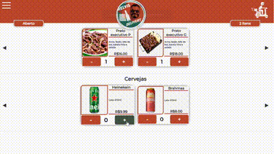
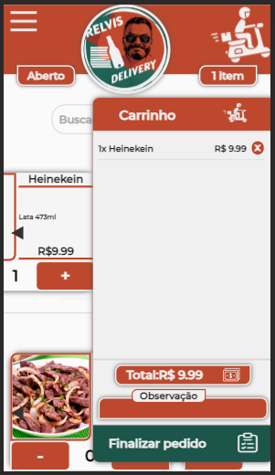
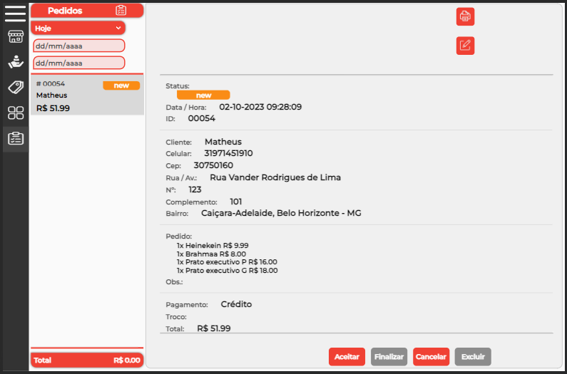

Link Project : 
    ITERFACE CLIENTE https://relvis-delivery-2-0.vercel.app/
    ITERFACE LOJA https://relvis-delivery-2-0.vercel.app/login

  

Relvis Delivery é um e-comerce simples para restaurantes, distribuidoras que fazem a gestão e o logística de suas próprias entregas e precisam de um sistema para gerenciar esse contato com cliente entre a loja.
Ele oferece soluções para recebimento de pedidos e gestão deles, podendo cancelar, aceitar e finalizar, além de imprimir em formato de cupom fiscal. O cliente tem uma rápida interção com site e ao finalizar sue pedido é enviado uma mensagem no whats da loja com pedido e também é recebido pelo sistema em sua interface da loja.

Aplicação é feita em Next.js com TypeScript, ele usa uma integração com firebase(banco de dados da Google) para salvar as informações, como clientes, pedidos, produtos e categorias entre outras informações, tendo acesso a um banco de dados por parte da loja para gerenciar e facilitar o dia dia do empreendedor. Layout responsivo e intuitivo.

Dependências:
-Firebase
-Luxon
-Axios
-Styled Components
-Next.js
-Context(gernciamneto global de estado)

  

  

